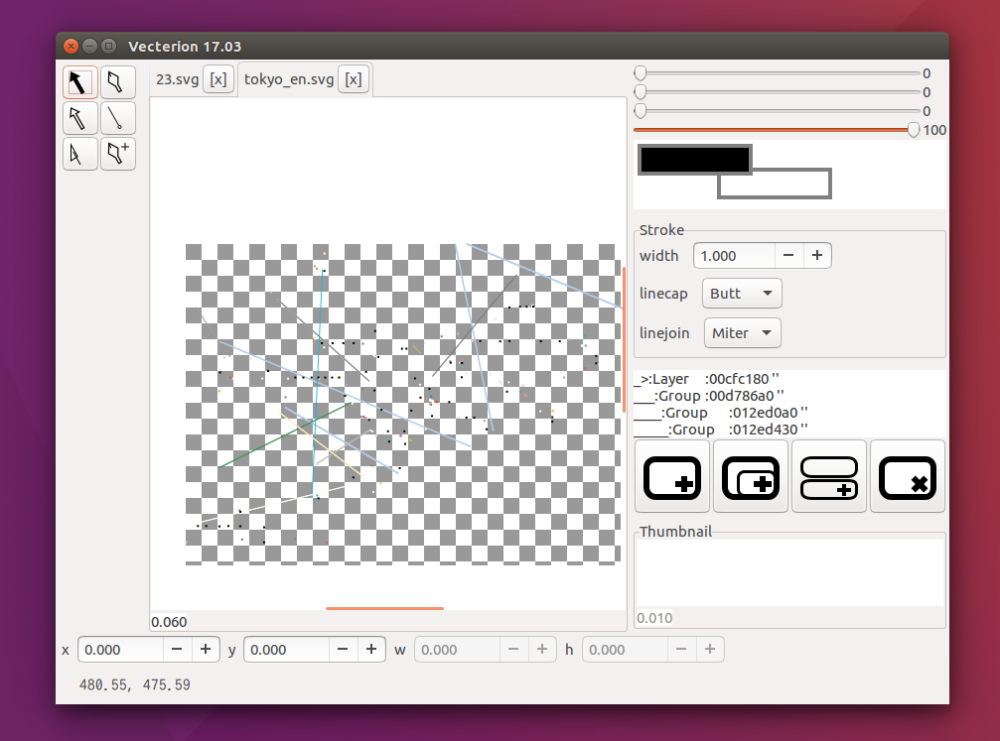

vecterion_vge - Vecterion vector graphics editor -
====

The Vecterion is true vector graphics editor for linux (and other).  

# About
Vecterionは、Linuxに本物のベクタ・グラフィックス・エディタを提供するプロジェクトです。  
ついでにWindows版も作成しています。  

# Detail
Vecterion is not Adobe Illustrator.  

# Screenshot/Image
  

# Project goal
- I makes money for happy life and enjoy develop!
- True vector graphic editor for linux.
- Font editor for the [project daisy bell][pixiv_booth_project_daisy_bell].

# Get Vecterion
get source: `git clone https://github.com/MichianriNukazawa/vecterion_vge`  

[Download for windows(v17.03)](https://github.com/MichinariNukazawa/vecterion_vge/releases/download/v17.03/vecterion_vge-win64-17.03-0c6dd16.zip)  
Download ubuntu package(.deb) @todo  

# Donate/Buy
@todo  
[project daisy bell][pixiv_booth_project_daisy_bell]  
[RuneAMN fonts Pro][gumroad_runeamn_fonts_pro] is daisy bell product.  

# Running
In Linux. (Ubuntu 16.04LTS+)  

In Windows is [README_win.md](README_win.md).  

## Build
`make`  
`make run`  

## Develop
`bash setup/setup.sh`  
read to [test/release_test.md](test/release_test.md).  

## Depend
External dependency in library/ directory.  
`cd library/`  

### gtk3
https://www.gtk.org/  
`sudo apt-get install libgtk-3-dev -y`  

### libxml2
http://www.xmlsoft.org/  
`git clone git://git.gnome.org/libxml2`  

### googletest
https://github.com/google/googletest  
`git clone --depth=1 https://github.com/google/googletest.git`  
`cd googletest/googletst/`  
`cmake . && make`  

Make up libgtest.a libgtest_main.a in googletest directory.  
Need for test.  

### rsvg
`sudo apt-get install rsvg -y`  
Need for test.  

# Specification

## Already implement
- edit bezier curve
- layer
- rgba color
- import svg file (status of alpha)
- save to svg file (ignore raster image)
- export png,jpg,bmp (raster image) file

import svg file:  
benchmark is [File:Ghostscript Tiger.svg](https://commons.wikimedia.org/wiki/File:Ghostscript_Tiger.svg)?  
 full visible feature and human eye lazy check.  

## Todo
### Short Todo
benchmark is [railmaps](https://github.com/hashcc/railmaps).  

- clipboard
    - clipboard Ctrl+X,C,V
    - clipboard Bitmap
- save svg included raster image
- confirm dialog when close unsaved document Ctrl+D
- more tools
- snaps (for pixel, grid, guide line, other element.)
    - snap for pixel
    - snap for radian (degree 45 ,90 ...)
- layer naming
- layer thumbnail
- element group
- auto save & crash recovery
- appearance
- documentation

### Long Todo
- dark skin ui
- scripting & CLI automation
- auto crash report
- auto update

## License
[LICENSE.md](LICENSE.md)  

# Contact
mail: [michinari.nukazawa@gmail.com][mailto]  
twitter: [@MNukazawa][twitter]  

Develop by Michinari.Nukazawa, in project "daisy bell".
[pixiv_booth_project_daisy_bell]: https://daisy-bell.booth.pm/
[gumroad_runeamn_fonts_pro]: https://gumroad.com/l/UNWF
[blog_article]: http://blog.michinari-nukazawa.com/
[mailto]: mailto:michinari.nukazawa@gmail.com
[twitter]: https://twitter.com/MNukazawa

