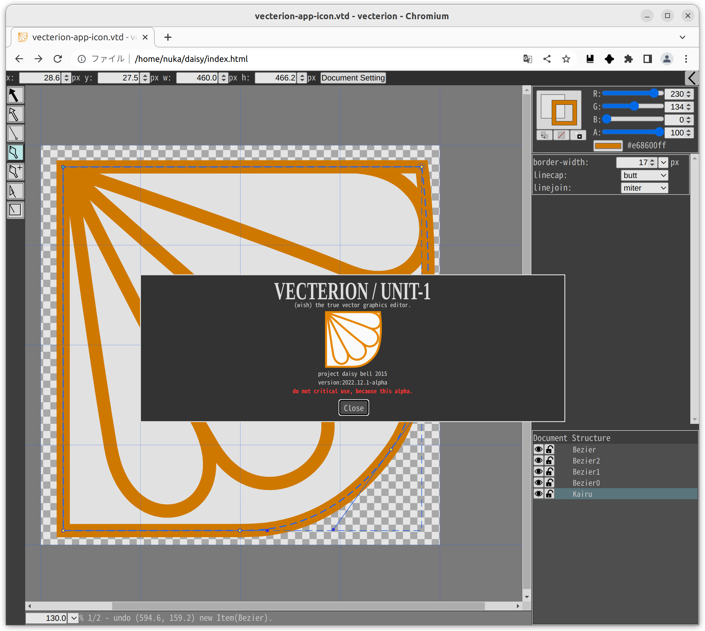

vecterion_vge - vector graphics editor -
====

# Get started
[Vecterion WebApp][gh-pages]  

# About
Vecterionは、Linuxに本物のベクタ・グラフィックス・エディタを提供するプロジェクトです。  
Windows等の対応もついでに行っています。  

Vecterion is not Adobe Illustrator.  

## Screenshot/Image
  

# Donate
[Vecterion (Pixiv/BOOTH)][vecterion_pixiv_booth]  
[Amazon wishlist][amazon_wishlist]  

# License
- vecterionは無料でデザイン作業に使用できます。
- vecterionは無保証です。
（vecterionは開発中のalphaです。重要な画像の編集には使用しないでください。）

開発者・企業の方へ：vecterion自体の改造や再配布には制限があります。
[DEVELOP.md](DEVELOP.md)をご覧ください。  

# Develop
[DEVELOP.md](DEVELOP.md)をご覧ください。  

# Contact
不明点等ありましたらお気軽にお問い合わせください。  
mail: [michinari.nukazawa@gmail.com][mailto]  
twitter: [@MNukazawa][twitter]  

Develop by Michinari.Nukazawa, in project "daisy bell".  

[gh-pages]: https://michinarinukazawa.github.io/vecterion_vge/
[pixiv_booth_project_daisy_bell]: https://daisy-bell.booth.pm/
[vecterion_pixiv_booth]: https://daisy-bell.booth.pm/items/451968
[amazon_wishlist]: https://www.amazon.co.jp/registry/wishlist/27VUIZGIHC8W9/
[mailto]: mailto:michinari.nukazawa@gmail.com
[twitter]: https://twitter.com/MNukazawa