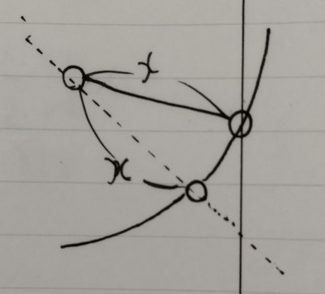
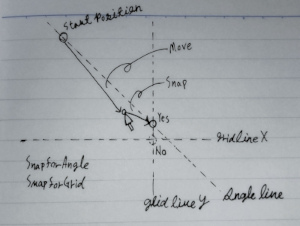
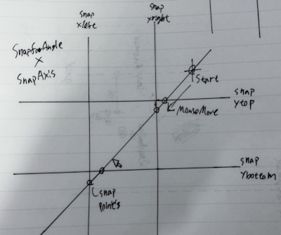
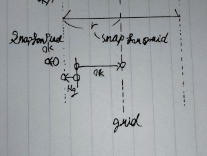

Snap
====

## Snapの仕様
Snapとは、ユーザのマウス操作によるItemまたはAPの編集操作が、Appにより補正される機能。
編集操作はMove,Resize,Rotateを指すが、Rotateは含まれないなど、Snap毎にSnapが有効な編集操作の範囲は異なる。

Snapの基本動作は移動を例に取ると、マウス操作で移動中のAPとSnap対象とのAxis間隔が`rOnField`より小さくなった際に、マウス操作量を上書きしてSnap対象まで移動量が変化する。
Snapは移動だけでなく、移動・拡縮・回転に適用される。
`rOnField`はFieldスケールの値とする。

Snapには次の５種類がある。
- SnapForAngle
- SnapForGrid
- SnapForPixel
- SnapForItem
- SnapForRule

SnapForAngleだけが、Shiftキー押下で発動する。
他はDocument設定に保存される。

SnapForItemは、おおむねAIの「ポイントにスナップ」。

表：MouseEdit*Snapの組み合わせとSnapの有無

|        | Angle | Grid | Guide | Item | Pixel |
| :----- | :---- | :--- | :---- | :--- | :---- |
| Move   | Yes   | Yes  | Yes   | Yes  | Yes   |
| Resize | Yes   | Yes  | Yes   | Yes  | Yes   |
| Rotate | Yes   | No   | No    | No   | No    |

※Angleを実装しないのは回転してSnapするための式を探すのが面倒だっただけ。いずれは実装してよい。

### SnapForAngleとその他Snapの優先順処理

Snap同士は組み合わせにより、掛け合いまたは競合する。
- SnapForAngleしながらSnapForGridする場合は掛け合いが起こり、ItemはGridとAngleの交点にSnapされる。
- SnapForPixelとSnapForGridが両方有効な状態では、Pixel小数のあるGridにSnapすると、SnapForPixelが満たされず競合する。
SnapForPixelはSnapForAngle以外のSnapと競合するため、優先度が必要。

VECではSnapの優先度を次の通りとする。
`SnapForAngle > SnapForGrid,Item,Guide > SnapForPixel`
SnapForPixelは他と競合した場合は無視する。

Grid,Item,Guide間の優先順位は同率とし、常に最も近い相手へSnapする。

実態としては、「Angle以外のSnap対象のうち最も近いものに常にSnap」という仕様であれば理論上はSnap同士の競合は発生しない。
だがこれを仕様とした場合のユーザ体験は、これら対象へのSnapが事実上機能しない。
「ほとんど常にPixelが最も近いSnap対象」となり、縮尺100%付近でGrid,Item,GuideにSnapするには精密なマウス操作が必要となるため。
この悪いユーザ体験を回避する仕様として、「SnapForAngle以外のSnapが掛かっていない状態であれば、SnapForPixelする」。

## Snapの実装

次の前提がある。
- Tool編集操作の実装は、編集開始時からの差分を用いている
Tool編集操作の項を参照。
（現時点で存在しないが）
（要約：
Tool編集操作はmousedownした開始時の状態を保持しておき現在までの移動量を足す仕組みを採用している。
mousemove event毎に移動量デルタの加算を続けているといずれ誤差が無視できなくなるのを避けることが目的。）

小数点演算には誤差があるため厳密にSnap位置を合わせるにはSnapした座標を代入するべきだが、VECでは実装の簡便のため移動量に変換する。

mousemove毎に繰り返す
mousemove移動した先で、最も近いAPとSnap対象の組み合わせを探す
rSnapWidthより近いものがなければSnapせず終了
最も近い組み合わせがSnapする移動量を計算

TODO
現状では「FocusItemsの外枠Rect」はAPと一致するためAPのSnapだけ考えれば良いが、将来的に「FocusItemsの外枠Rect」をSnap対象に含める必要がある。
詳細はFocusの項を参照。
（現時点で存在しないが）
（要約：
現在のItemはAPのみで外枠Rectを算出しているが、これはItemの見た目の外周と一致しない。
例えば、BezierCuriveの曲線はAPのRectの範囲から外に出る。
...ので、Snapは将来的にこの「BezierとLinecapとBorderWidth...etcを含むItemの外枠」をSnap対象に含める必要がある。）

### 複数Focus

Snapを行うのはマウス操作によるTool編集のみ。
（現行の実装でAxisInputが整数丸めを行っているがSnapとは無関係。）

- Focusには複数のItem,APが含まれる。

- 編集対象にはToolによりItem,APが切り替わる。

